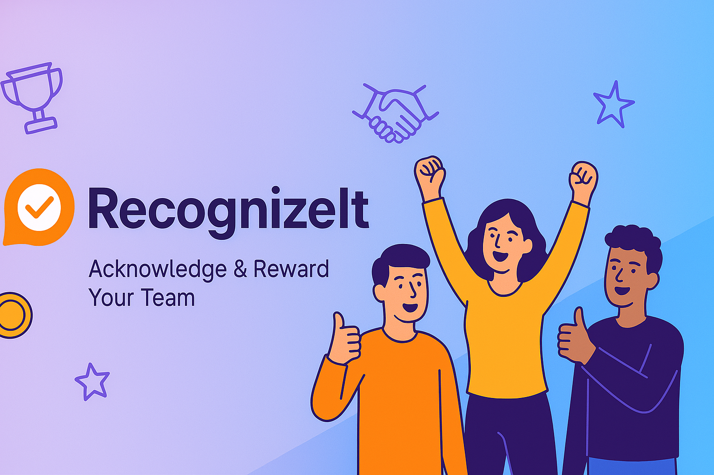
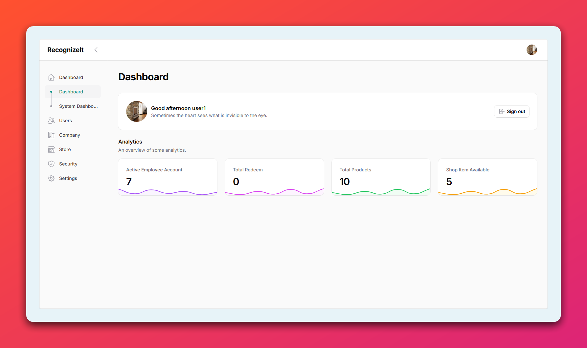
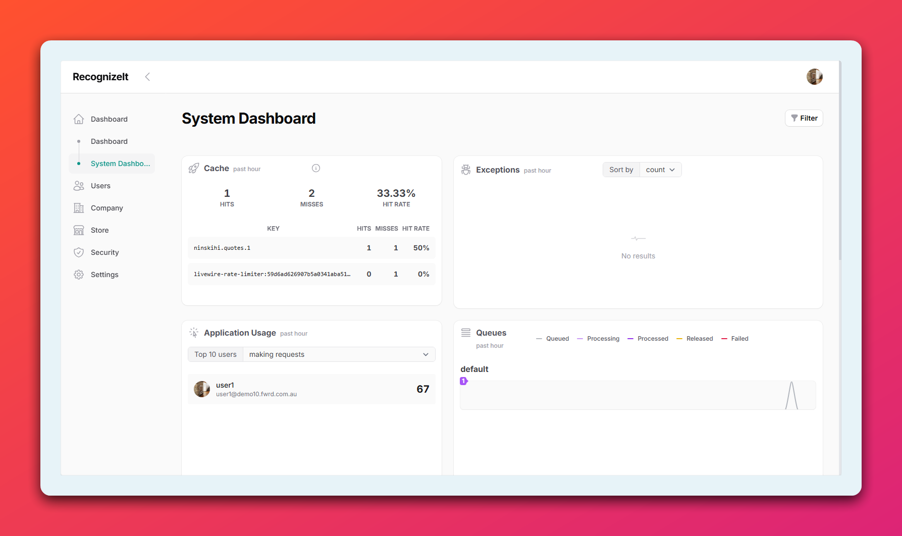
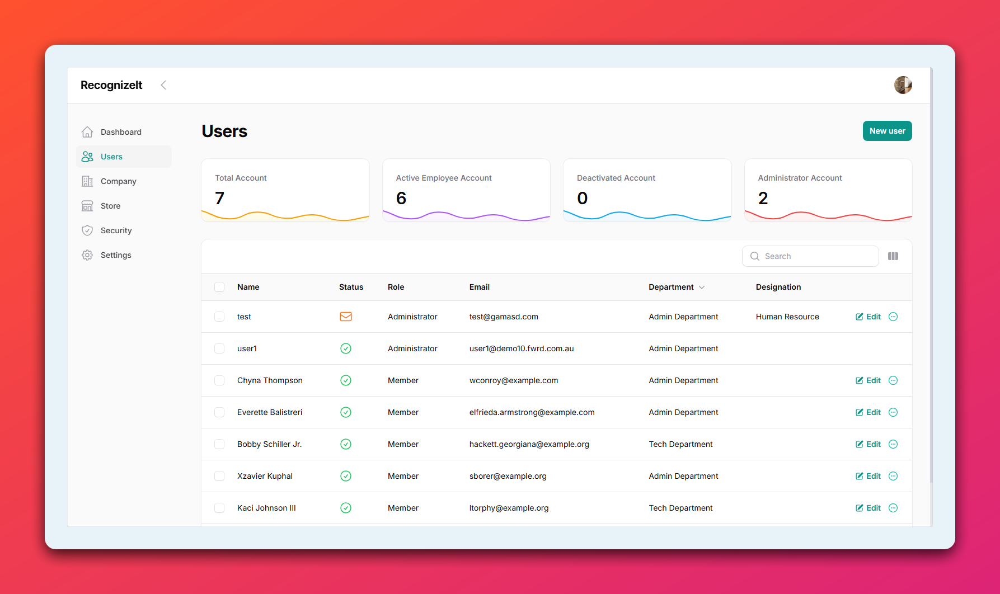
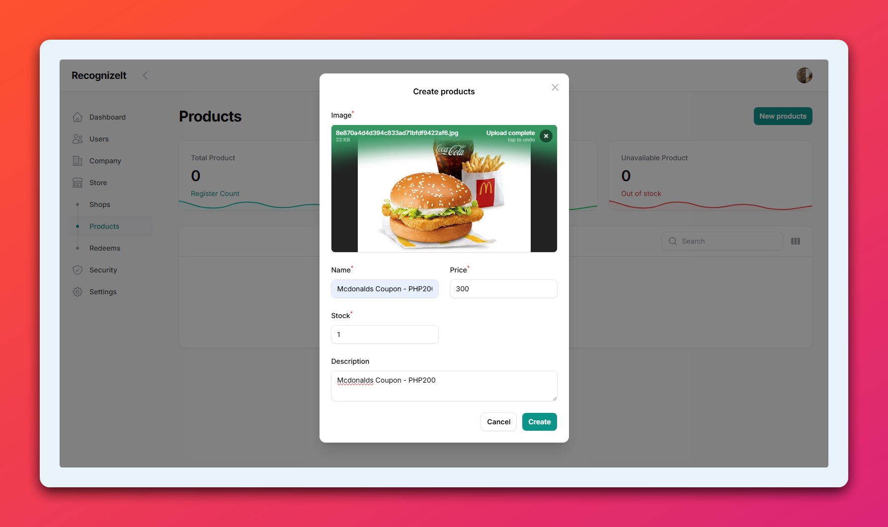

> Inspiring Recognition: Celebrate Success.

# Overview

**RecognizeIt** is a Backend Skeleton App Server that use Laravel Technology.

## What is **RecognizeIt**

In the context of the app, **RecognizeIt** is designed to facilitate the recognition of colleagues' contributions and achievements within a company. It aims to enhance workplace culture by providing a platform for employees to acknowledge and celebrate each other's efforts, fostering a more engaged and positive work environment.

## Purpose

The purpose of the app is to foster a positive and collaborative work environment by enabling employees to recognize and celebrate their colleagues' achievements and contributions. By providing a platform for employees to acknowledge and appreciate each other's efforts, **RecognizeIt** aims to enhance morale, build stronger team relationships, and reinforce a culture of mutual respect and support within the company. Through simple, intuitive features, **RecognizeIt** allows users to give and receive recognition in real-time, ensuring that accomplishments are celebrated and valued, ultimately driving a more engaged and motivated workforce.

## Mobile App

_Coming Soon_

## Documentation

##### :book: [Visit Documentation](https://ninshiki-project.github.io/RecognizeIt-backend-community/overview.html)

## Extensions

##### :hammer_and_wrench: [Visit Available Extension](https://ninshiki-project.github.io/RecognizeIt-backend-community/extensions.html)

## Application Screenshot (Backend-Admin Portal)

## License

[GNU GPLv3](https://choosealicense.com/licenses/gpl-3.0/)
