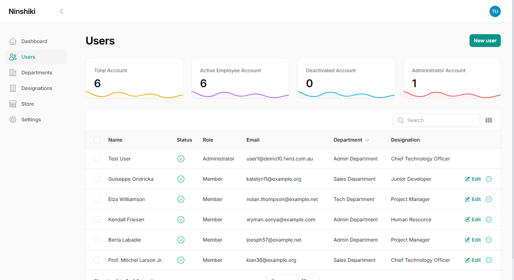

# Overview

Ninshiki is a Backend Skeleton App Server that use Laravel Technology.

> Ninshiki (認識; Nin-shiki) literally means "recognition" in Japanese. Inspiring Recognition: Celebrate Success.

## What is Ninshiki

"Ninshiki" is a Japanese term that translates to "recognition" or "awareness" in English. In the context of the app, Ninshiki is designed to facilitate the recognition of colleagues' contributions and achievements within a company. It aims to enhance workplace culture by providing a platform for employees to acknowledge and celebrate each other's efforts, fostering a more engaged and positive work environment.

## Purpose

The purpose of the Ninshiki app is to foster a positive and collaborative work environment by enabling employees to recognize and celebrate their colleagues' achievements and contributions. By providing a platform for employees to acknowledge and appreciate each other's efforts, Ninshiki aims to enhance morale, build stronger team relationships, and reinforce a culture of mutual respect and support within the company. Through simple, intuitive features, Ninshiki allows users to give and receive recognition in real-time, ensuring that accomplishments are celebrated and valued, ultimately driving a more engaged and motivated workforce.

## Mobile App

_Coming Soon_

## Documentation

##### :book: [Visit Documentation](https://ninshiki-project.github.io/Ninshiki-backend/overview.html)

## Extensions

##### :hammer_and_wrench: [Visit Available Extension](https://ninshiki-project.github.io/Ninshiki-backend/extensions.html)

## Application Screenshot (Backend-Admin Portal)

## License

[GNU GPLv3](https://choosealicense.com/licenses/gpl-3.0/)
